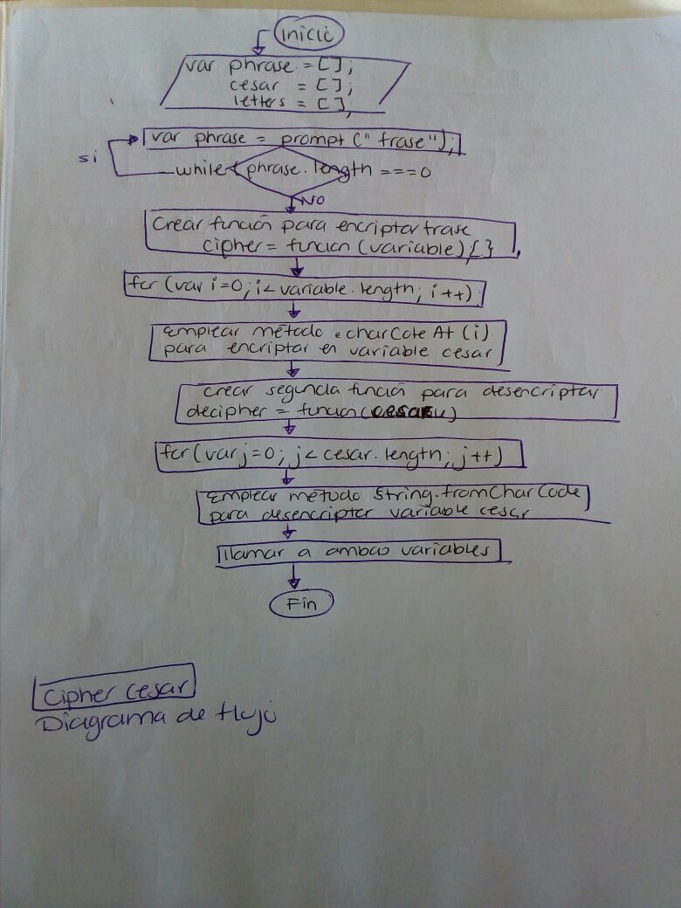

## cipher-cesar

1. Por medio de un prompt(), pedir una frase al usuario. Corroborar que el usuario no pueda ingresar un campo vacío o que contenga números
2. Devuelva el mismo mensaje en codigo ASCII
3. Aplicar la formula de Cifrado César con el parámetro de desplazamiento de 33 espacios hacia la derecha
3. Regresar el valor de cada una de las letras aplicando el metodo String.fromCharCode()

