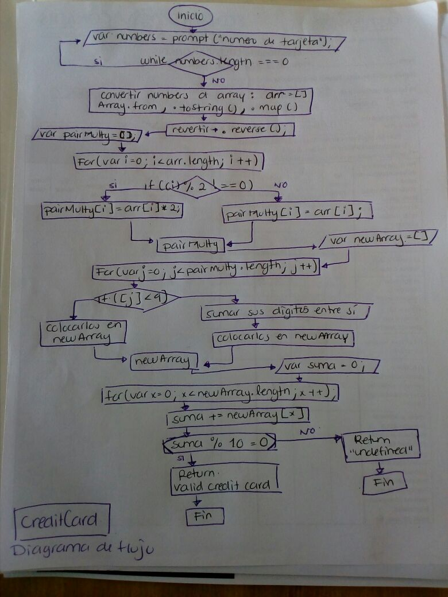

/*Crea una web que pida, por medio de un prompt(), el número de una tarjeta de crédito y confirme su validez según el algoritmo de Luhn
Tu código debe estar compuesto por 1 función: isValidCard
El usuario no debe poder ingresar un campo vacío*/

## Tarjeta de credito valida

1. Preguntar por el numero de tarjeta y Corroborar que el usuario no ingrese un campo vacío
2. Pasar los numeros a un array en orden inverso
3. Multiplicar por 2 los números de las posiciones pares. Si se obtiene un valor con 2 dígitos, sumar los dígitos entre sí.
4. Sumar estos nuevos digitos y los demas digitos (posiciones impares)
5. Comprobar si es una tarjeta valida dividiendo la suma total entre 10 y obteniendo modulo 0

